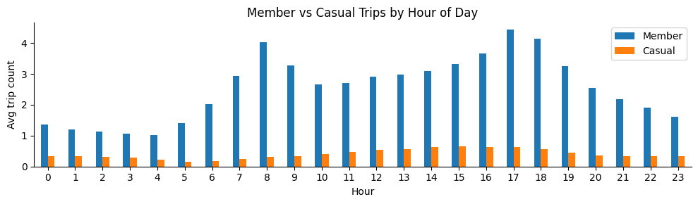
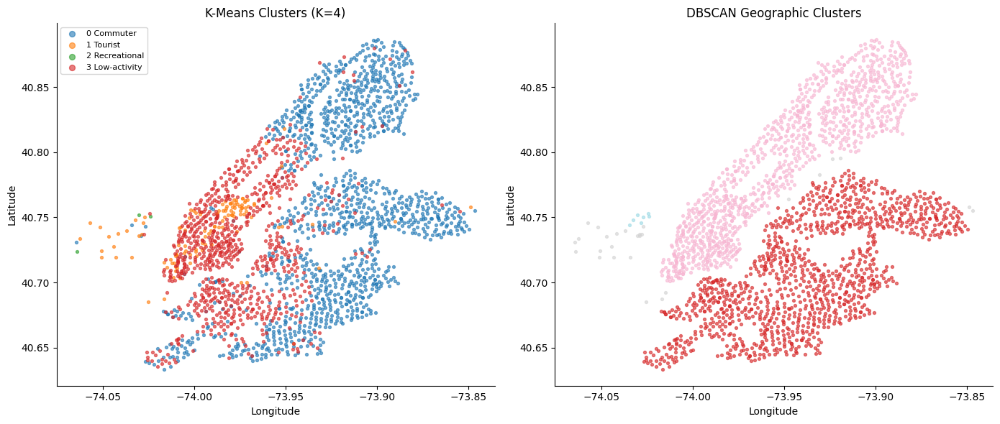
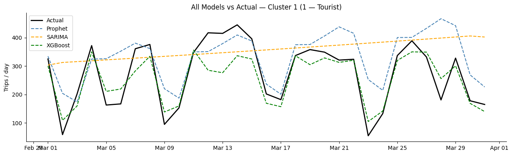
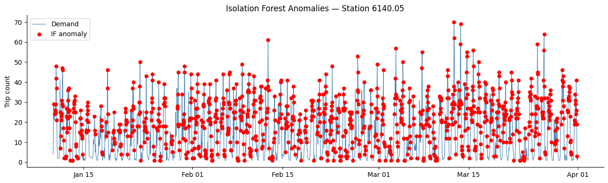
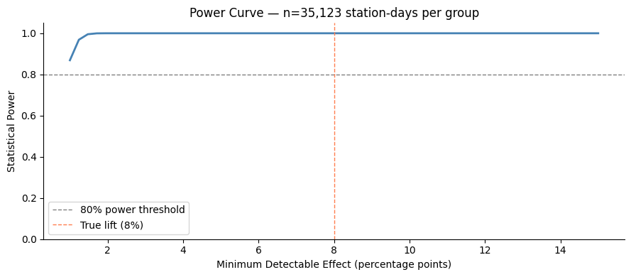
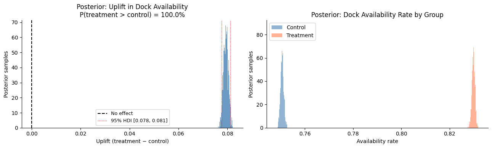
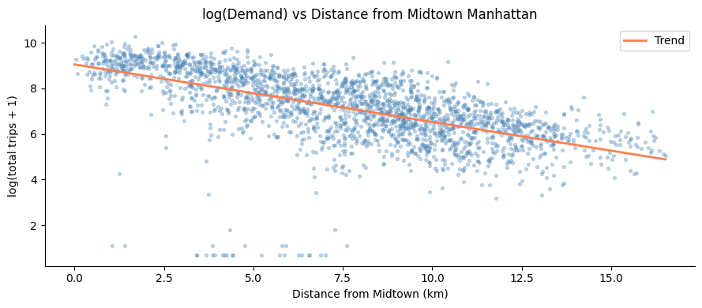

# Citi Bike Demand Forecasting & A/B Testing Framework

End-to-end ML pipeline for forecasting station-level bike demand, segmenting stations by usage pattern, detecting anomalies, and designing a statistically rigorous A/B test for a rebalancing intervention — all on publicly available Citi Bike trip data.

---

## The Problem

Citi Bike's biggest operational challenge is **rebalancing** — bikes pile up at popular destination stations while origin stations run dry. This project builds the data infrastructure to:

1. Predict hourly demand per station (so bikes can be pre-positioned)
2. Segment stations by usage type (commuter vs tourist vs recreational) for cluster-level experiment design
3. Detect demand anomalies (events, outages) to clean experiment baselines
4. Simulate and analyse a rigorous A/B test comparing the current heuristic vs an ML-optimized rebalancing schedule

---

## Skills Demonstrated

| Area | Methods |
|---|---|
| Time series forecasting | Prophet, SARIMA, XGBoost with lag features |
| A/B experiment design | Power analysis, Welch t-test, Mann-Whitney U |
| Sequential testing | O'Brien-Fleming alpha spending boundaries |
| Bayesian inference | PyMC — posterior on uplift, 95% HDI, P(T>C) |
| Clustering | K-means (demand profile), DBSCAN (geospatial) |
| Anomaly detection | Z-score (rolling), IQR per time slot, Isolation Forest |
| Geospatial analysis | Folium heatmaps, animated demand maps, distance features |

---

## Notebooks — Run in Order

| # | Notebook | What it does | Key outputs |
|---|---|---|---|
| 01 | `01_eda.ipynb` | Load & clean 3 months of trip data. Demand patterns by hour, day, station. Geographic spread. | `hourly_demand_2024Q1.parquet`, `station_summary_2024Q1.parquet` |
| 02 | `02_clustering.ipynb` | Build per-station feature matrix. K-means (K=4) → commuter / tourist / recreational / low-activity. DBSCAN geospatial clusters. Folium map. | `station_clusters.parquet`, `cluster_map.html` |
| 03 | `03_forecasting.ipynb` | Prophet, SARIMA, XGBoost on one representative station per cluster. Train Jan–Feb, test Mar. MAE/RMSE/MAPE comparison. | Model comparison table + forecast plots |
| 04 | `04_anomaly_detection.ipynb` | Z-score (rolling 1-week window), IQR (per station × hour-of-day slot), Isolation Forest. Consensus anomalies = flagged by 2+ methods. | `anomaly_flags_2024Q1.parquet` |
| 05 | `05_ab_testing.ipynb` | Power analysis → required station-days per group. Simulate A/B outcomes. Frequentist (t-test, Mann-Whitney). Sequential (O'Brien-Fleming). Bayesian (PyMC posterior on uplift). | Full results summary |
| 06 | `06_geospatial.ipynb` | Demand heatmap, hour-of-day animated heatmap, cluster+A/B map. Demand decay with distance from Midtown. | `maps/demand_heatmap.html`, `maps/demand_animation.html`, `maps/cluster_ab_map.html` |

---

## Results at a Glance

### EDA — Demand Heatmap (Hour × Day of Week)


### Clustering — Station Demand Profiles (K-means K=4)


### Forecasting — Model Comparison (MAPE by Cluster)


### Anomaly Detection — Isolation Forest on Daily Demand


### A/B Test Design — Power Curve & Sequential Test



### Geospatial — Demand Decay with Distance from Midtown


---

## Setup

### 1. Clone the repo

```bash
git clone https://github.com/<your-username>/demand-forecasting-experiment-design.git
cd demand-forecasting-experiment-design
```

### 2. Create a virtual environment

```bash
python -m venv venv

# Activate — macOS/Linux:
source venv/bin/activate

# Activate — Windows:
venv\Scripts\activate
```

### 3. Install dependencies

```bash
pip install -r requirements.txt
```

> **Note on Prophet:** Prophet requires `cmdstanpy` which downloads Stan on first use. If `prophet` fails to install, run `pip install pystan` first.

> **Note on PyMC:** PyMC can take a few minutes to install due to `pytensor`. On Windows, install from a regular command prompt (not PowerShell) if you hit issues.

### 4. Download the data

The raw Citi Bike trip data is not included in this repo (files are ~200MB each). Download Jan–Mar 2024 from the public S3 bucket:

```bash
python src/data/download.py
```

This downloads `202401-citibike-tripdata.zip`, `202402-citibike-tripdata.zip`, `202403-citibike-tripdata.zip` into `data/raw/`. Takes a few minutes depending on connection speed.

### 5. Launch JupyterLab

```bash
jupyter lab
```

Open notebooks in order from the `notebooks/` directory and run all cells.

---

## Project Structure

```
demand-forecasting-experiment-design/
├── requirements.txt
├── .gitignore
│
├── data/
│   ├── raw/              # Downloaded zip files (gitignored)
│   └── processed/        # Parquet outputs + HTML maps (gitignored)
│
├── notebooks/
│   ├── 01_eda.ipynb
│   ├── 02_clustering.ipynb
│   ├── 03_forecasting.ipynb
│   ├── 04_anomaly_detection.ipynb
│   ├── 05_ab_testing.ipynb
│   └── 06_geospatial.ipynb
│
├── src/
│   ├── data/
│   │   ├── download.py        # Citi Bike S3 downloader
│   │   └── preprocess.py      # Cleaning, hourly aggregation, time features
│   ├── models/
│   │   ├── clustering.py      # K-means, DBSCAN, feature engineering
│   │   ├── forecasting.py     # Prophet, SARIMA, XGBoost wrappers + evaluation
│   │   └── anomaly.py         # Z-score, IQR, Isolation Forest
│   ├── experiments/
│   │   ├── power_analysis.py  # Sample size calculations, power curves
│   │   ├── ab_test.py         # Simulation, t-test, Mann-Whitney, sequential testing
│   │   └── bayesian_ab.py     # PyMC Bayesian A/B model
│   └── visualization/
│       ├── maps.py            # Folium heatmaps and cluster maps
│       └── plots.py           # Matplotlib/Seaborn chart helpers
│
└── tests/
    └── test_ab_test.py
```

---

## Key Design Decisions

**Cluster-level A/B randomization** (not station-level): Bikes move between stations, so randomizing at the station level would cause interference between treatment and control groups (SUTVA violations). Randomizing at the cluster level keeps treatment and control geographically separated.

**XGBoost over LSTM**: Lag features + calendar features on tabular hourly data. Faster to train, easier to interpret, and competitive accuracy without requiring a GPU.

**Prophet as baseline**: Handles daily/weekly seasonality and US holidays out of the box — a realistic operational baseline for comparison.

**Consensus anomalies**: Rather than picking one anomaly detection method, flagging station-hours where 2 or more methods agree reduces false positives for the A/B experiment baseline.

**Bayesian A/B alongside frequentist**: Frequentist tests give a binary reject/fail-to-reject. The PyMC Bayesian model gives P(treatment > control) and a credible interval on the uplift — more actionable for operations teams deciding whether to roll out the new policy.

---

## Data Source

[Citi Bike System Data](https://citibikenyc.com/system-data) — publicly available on AWS S3. This project uses Jan–Mar 2024 monthly trip data (~10M trips total).
